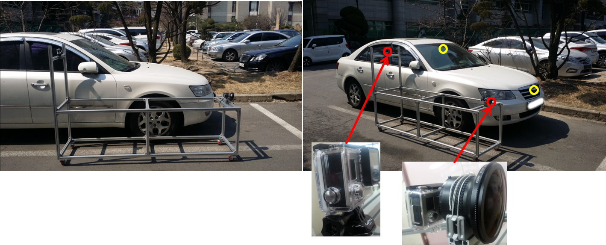

## Heterogeneous stereo system for vehicle
In this project, we try to solve heterogeneous stereo matching problem with cameras mounted on the vehicle. 
Assume that one camera is for lane departure warning system (LDWS) and the other is for around view monitoring (AVM).
Solving a stereo matching probelm in this configuration is quite challenging, because the displacement between two cameras is large and their focal lengths are quite different.

*This is an unfinished research*{: style="color: red"}

### System configuration
* LDSW camera
  * Narrow fov
  * Mounted behind the windshield
* front AVM camera: wide fov 
  * Wide fov (180 degree)
  * Mounted on the front grill

