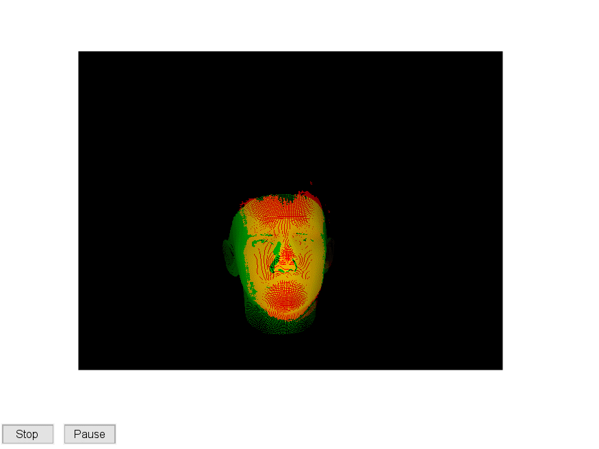

## Head pose estimation in depth images
Unofficial implementation of the paper, P. Padeleris, X. Zabulis, and A. A. A. Argyros, “[Head pose estimation on depth data based on Particle Swarm Optimization,” *2012 IEEE Computer Society Conference on Computer Vision and Pattern Recognition Workshops*, pp. 42–49, 2012.

[Code]()

### Demonstration on [ETH dataset](https://www.vision.ee.ethz.ch/datasets/headposeCVPR08/)
1m|3m
|
