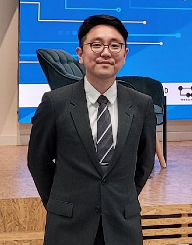

||Moonsoo Ra received the B.S. and Ph.D. degrees in Electronics and Computer Engineering at [Hanyang University](http://www.hanyang.ac.kr/), Seoul, Korea, in 2011 and 2019, respectively. He is currently working as founding member and CTO of LightVision©. His research interests include pattern recognition, machine learning, autonomous vehicle, and video surveillance.|
## Contacts
E-mail: ravicmoon@gmail.com

## Pet Projects
- [tf.FCN](https://github.com/ravicmoon/tf.FCN)
- [tf.DenseNet](https://github.com/ravicmoon/tf.DenseNet)

## Education
|Ph.D. in Electronics and Computer Engineering\Hanyang University, Seoul, Korea|2011-2019|
|BE in Electronics and Computer Engineering\Hanyang University, Seoul, Korea|2008-2011|

## Projects in [Video Image Engineering Lab](http://vision.hanyang.ac.kr/)
- [Security video condensation](compaq_video.md)
- [Wafer defect detection and recognition](defect.md)
- [Blind spot detection with side-rectilinear images](bsd.md)
- [Around-view monitoring (AVM) system](avm.md)
- [Heterogeneous stereo system for vehicle](hetero_stereo.md)
- [Head pose estimation in depth images](hpe.md)

## Awards
|Graduation Prize|Hanyang University, Seoul, Korea|2011.02|

## Journal Publications
- Y. Yoon, J. Lee, **M. Ra**, H. Gwon, S. Lee, M. Y. Kim, K.-C. Yoo, O. Sul, C. G. Kim, W.-Y. Kim, J.-G. Park, S.-J. Lee, Y. Y. Lee, H. S. Choi, and S.-B. Lee, "[Continuous Separation of Circulating Tumor Cells from Whole Blood Using a Slanted Weir Microfluidic Device](https://doi.org/10.3390/cancers11020200)," *Cancers*, vol. 11, no. 2, Feb, 2019
- **M. Ra**, W.-Y. Kim, "[Parallelized tube rearrangement algorithm for online video synopsis](https://doi.org/10.1109/LSP.2018.2848842)," *IEEE Signal Processing Letters*, vol. 25, pp. 1186-1190, Aug, 2018
- **M. Ra**, H. G. Jung, J. K. Suhr, W.-Y. Kim, "[Part-based vehicle detection in side-rectilinear images for blind-spot detection](https://doi.org/10.1016/j.eswa.2018.02.005)," *Expert Systems with Applications*, vol. 101, pp. 116-128, Jul, 2018
- **M. Ra**, M. S. Muhammad, C. Lim, S. Han, C. Jung, and W.-Y. Kim, “[Smartphone-Based Point-of-Care Urinalysis Under Variable Illumination](https://doi.org/10.1109/JTEHM.2017.2765631),” *IEEE Journal of Translational Engineering in Health and Medicine*, vol. 6, Dec, 2017
- J. Lee, M. Pyo, S. Lee, J. Kim, **M. Ra**, W.-Y. Kim, B. J. Park, C. W. Lee, and J.-M. Kim, "[Hydrochromic conjugated polymers for human sweat pore mapping](https://doi.org/10.1038/ncomms4736)," *Nature Communications*, vol. 5, 2014

## Patents
- [Apparatus for providing tactile signals converted from image information and method thereof](https://doi.org/10.8080/1020130082120), 10-1428401-0000, KR
- [Method of image processing and device thereof](https://doi.org/10.8080/1020110108378), 10-1283262-0000, KR
- [Apparatus, method and computer readable medium having computer program for compact video](https://doi.org/10.8080/1020160087017), 10-1805018-0000, KR
